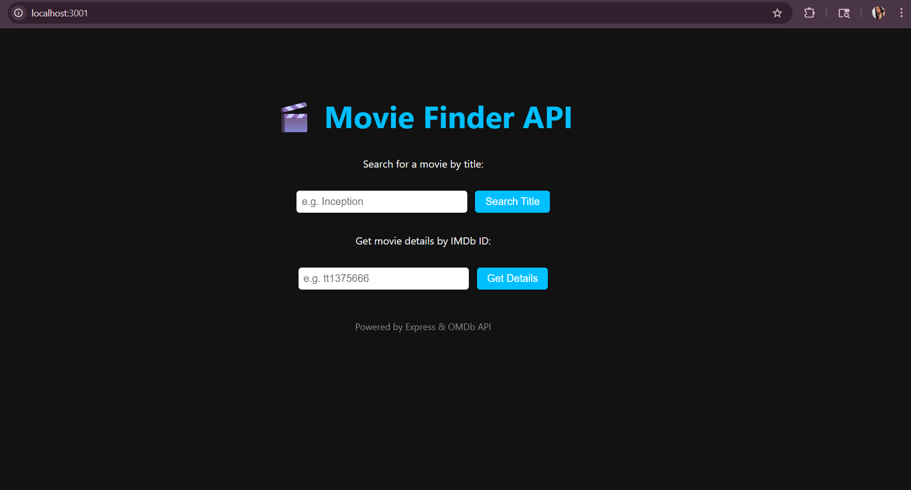

# 🎬 Movie Finder API

An Express.js backend API that fetches movie data from the [OMDb API](https://www.omdbapi.com/) and provides a user-friendly landing page for searching movie titles or getting details by IMDb ID.

---
## 🖼️ Screenshot

> 📸 Add a screenshot of your running app here  
> Example:  

---

## 🚀 How to Test in Browser

### Search for movies by title.
/api/search?title=movieTitle

### Fetch movie details by IMDb ID.
/api/movies/:id
